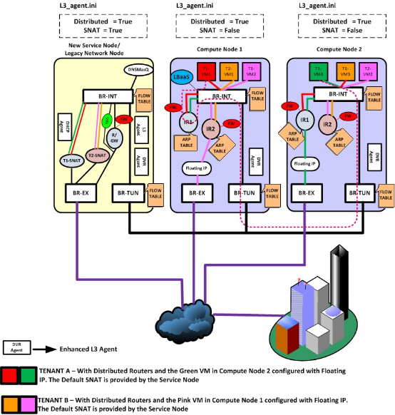
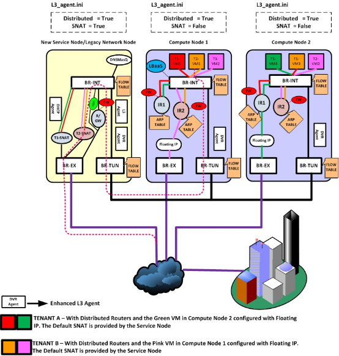
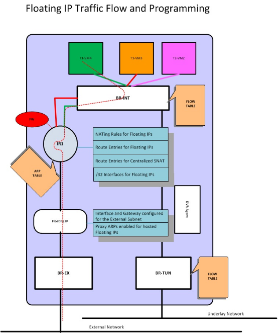

## 引入原因
降低网络节点的负载，同时提高可拓展性

## 实际
让计算节点自己来处理原先大量的东西向流量和DNAT流量(有floating ip的vm跟外面的通信)
如此一来网络节点只需要处理占到一部分的SNAT(无floating IP的vm与外面的通信)流量，大大降低了负载和整个系统对网络节点的依赖。
DHCP服务和VPN服务仍然集中在网络节点上进行。

## 优势
1. 东西向的吞吐量增加
2. 高东西流量下VM平均带宽增加
3. 南北向流量和东西向流量不再互相干扰
4. 当东西向流量在同一个hypervisor上，就不会走过不必要的路径

## 分类
### 东西向
- 同一台机器：直接通过br-int转发，不经过外部网桥
- 不同机器
同一个租户的两台vm分布在两个计算节点上，并且位于不同的子网
位于计算节点1的vm1发送数据到位于计算节点2的vm2，br-int截获数据包并把源mac地址从目标子网网关的mac地址改成br-tunnel端口的mac地址。计算节点2的br-int截获数据包后将源mac地址为tunnel端口的mac地址改成正常的子网网关的mac地址。再将数据包转发给虚拟机。

### 南北向
- 无floating ip
租户从外部访问虚拟机，网络节点上的T2-SNAT起到了路由器的作用
为什么要从网络节点走：因为对于外部网络来说只能看到外部接口的地址，这个地址只有一个。

- 有floating ip
计算节点上有专门负责的外部路由器将负责转发

网络节点上配置dvr_snat模式
命名空间多了snat-xxx命名空间，处理来自计算节点的无floating ip的南北向流量

计算节点
需要额外启用l3_agent(dvr模式)，以及metadata agent
与传统情况下相比，单独有一个 qfloat-XXX 路由器（也在一个独立命名空间中）来负责处理带有 floating IP 的南北向流量

