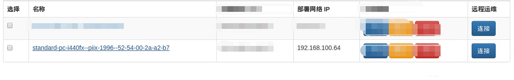
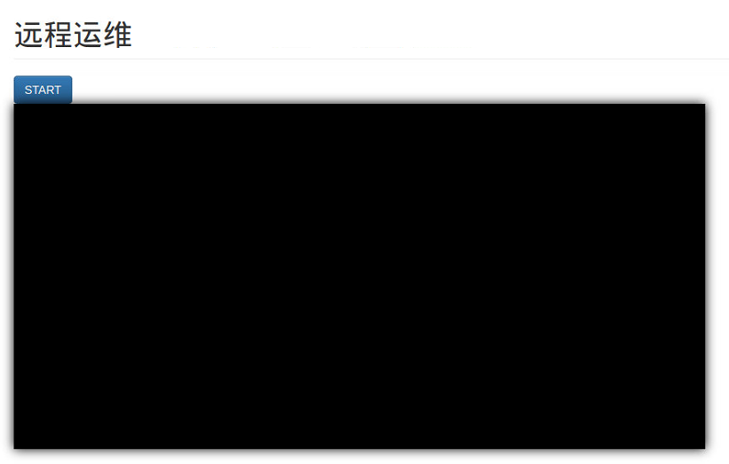
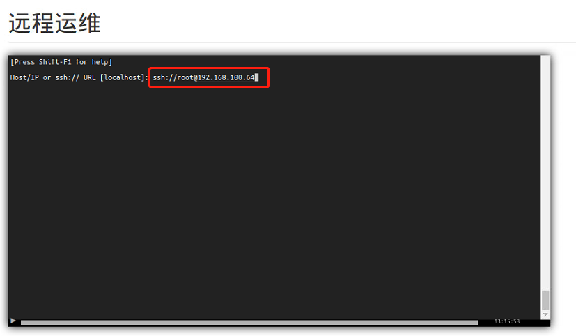
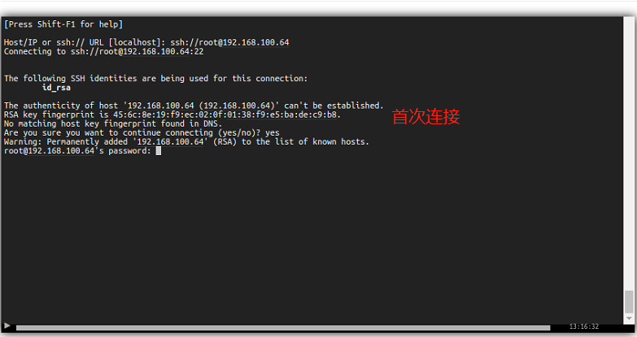

实现目标：使用web-ssh希望实现的功能是通过在网页上进行远程运维，简单来说就是实现了一个网页版的ssh登录界面。自动登录对方的主机然后执行相关命令（像使用客户端putty一样）。

原本的ssh客户端在运维管理中有点麻烦，不同的用户需要不同等登录名、授权等管理，而且存在一定的风险，可能会导致个人电脑被攻击等安全问题…一般的解决方案包括堡垒机、跳板机等一系列安全措施来防止系统非法访问。跳板机就是先登录到一台服务器 再通过这台服务器登录到目标服务器上；堡垒机对运维人员的身份认证、对运维操作的访问控制和审计等功能。
Web-ssh是可以替代堡垒机的功能的一个软件。
前期调研，我了解了几个比较普及的web-ssh工具，比如gateone、shellinabox、web-shell、qweb等等，这里主要是研究了gateone。下面将记录gateone使用的文档。

## 1.安装python2.7+, tornado 2.2+
1.1 安装前提
```shell
python -V
wget --no-check-certificate https://bootstrap.pypa.io/get-pip.py
sudo python get-pip.py
sudo pip install tornado
```
1.2 验证安装环境
```shell
python -V
python -c "import tornado; print(tornado.version)"
```
## 2.GateOne的获取和安装

2.1 通过git上源码获取
```
sudo apt-get install git
git clone https://github.com/liftoff/GateOne.git
cd GateOne
sudo python ./setup.py install
```
2.2 安装过程中可能会遇到的问题

 安装HTML5lib时提示setuptools版本太低，需要升级
```
pip install -U setuptools
```
将setup.py成功运行之后即可启动gateone服务，至此，gateone的安装完成

## 3.GateOne的测试

默认的配置文件是/etc/gateone/conf.d/10.server.conf（位置不是绝对的）
```
sudo gateone
```
默认打开的端口号为443。在浏览器中输入''https://127.0.0.1:443''。
如果配置成功，会出现gateone的页面。点击Terminal图标，可以在web端上使用命令行、也可以通过ssh登录到其他主机上进行操作。

## 4.GateOne嵌入到其他应用中

4.1 配置文件的修改

我们使用`GateOne/gateone/docs/embeddings_configs/99tutorial_chapter1.conf`作为默认的配置文件，可以设置端口号以及是否需要验证等

 本身这个文件是有一个语法问题， `auth=none`后面要加上一个`,`,不然运行的时候会报错

- `origin = [*]`表示不对源进行检查
- `"port": 8000` 修改数字可以改变gateone的端口号

4.2 将配置文件放到一个目录下，并运行gateone(运行时需要添加setting_dir参数)
```
mkdir /tmp/chapter1
cd GateOne
cp gateone/docs/embedding_configs/99tutorial_chapter1.conf /tmp/chapter1
./run_gateone.py --setting_dir=/tmp/chapter1
```
4.3 将`Gateone/gateone/static/gateone.js`复制到应用的static文件夹中
4.4 在你想要展示的页面文件.html文件下添加以下内容：
```html
<div id="gateone"></div>
//或者调一调格式啥的
<div id="gateone_container" style="width:60em; height:30em;">
    <div id="gateone"></div>
</div>
```
4.5 引入gateone.js文件
```javascript
<script src="https://your-gateone-server/static/gateone.js"></script>
```
4.6 调用`GateOne.init()`函数来进行信息传递
```javascript
GateOne.init({url:"https://yourgateone-server/:port"})
```

## 5.gateone免密码登录(autologin)
其实gateone的url可以变为`https://ip_addr:port/?ssh=ssh://hostname@host_ipaddr`,这样只需要输入密码即可通过SSH访问其他主机。但还是不方便，如果有很多台主机，还要记住一堆主机的密码...

5.1 SSH 免密码登录 具体的操作步骤就不提了

 5.2 将id_rsa写入到.default_ids里，形成对应关系
```shell
echo id_rsa > /var/lib/gateone/user/ANOUNYOUS/.ssh/.default_ids
```
 5.3 修改`GateOne.init`函数，添加参数`autoconnect_url`
一点小建议：

- 首先确保本机能够免密码登录到远程主机，首次登录的时候可能要输入yes，可以在远程主机中进行设置`ssh -o stricthostkeychecking=no`
-  保存公钥的那个文件是要自己创建的，是个隐藏文件，文件名不要打错了，不然gateone会找不到这个文件
- gateone URL根据你自己远程主机信息进行改写
-  如果上述步骤都执行了，还是不行的话，建议查看log文件，具体问题具体分析

ps：在gateone的开源代码中，其实有一些简单的已经实现好的实例，可以去玩一下。


## 实例
这里主要分享下项目里的代码。
点击`start`按钮可以添加一个终端。用一个div承载gateone的terminal。
```

<form id="add_terminal">
    <input type="submit" value="START" class="btn btn-primary"
           id="connect_btn"></input>
</form>
<div id="gateone_container" style="position: relative; width: 60em; height: 30em;">
    <div id="gateone"></div>
</div>

```
相关的javascript代码
```javascript
<script src="{{ url_for('static', filename='gateone.js')}}"></script>
<script type="text/javascript">
   window.onload = function(){
   authobj = {{auth_object|tojson}}
   gateone_url = {{gateoneURL|tojson}}
   GateOne.init({
       auth: authobj,
       url: gateone_url,
       embedded: true,
       style: {'background-color': 'black', 'box-shadow': '0 0 20px black'}
   });
}
</script>
<script>
    document.querySelector('#add_terminal').onsubmit = function(e) {

        var existingContainer = GateOne.Utils.getNode('#'+GateOne.prefs.prefix+'container'),
            container = GateOne.Utils.createElement('div', {
                'id': 'container', 'class': 'terminal', 'style': {'height': '100%', 'width': '100%'}
            }),
            gateone3 = GateOne.Utils.getNode('#gateone');
        e.preventDefault(); // Don't actually submit the form
        if (!existingContainer) {
            gateone3.appendChild(container); // Put our terminal in the container
        } else {
            container = existingContainer;
        }
        autoURL = {{autoURL|tojson}}
        termNum = GateOne.Terminal.newTerminal(null, null, container); // Create the new terminal
        GateOne.Terminal.sendString(autoURL,null)
        $('#connect_btn').hide()
    }
    </script>
```
效果图
提供一个入口进入远程运维界面。

这里提供了一个start按钮，用于生成新的terminal。开始远程运维。点击start按钮后start按钮会消失。

我们通过一个sendString的命令将autoURL传到命令行。只需要回车就可以直接执行这个命令。

首次登录的时候需要通过签名认证，需要手动填一个yes。如果私钥公钥不匹配的话，会提示让你输入密码


博文内容参考链接：
参考网址：
http://liftoff.github.io/GateOne/Developer/index.html#embeddeding-gate-one-into-other-applications
http://www.cnblogs.com/lienhua34/p/4876300.html
http://www.cnblogs.com/lienhua34/p/4884115.html
https://github.com/liftoff/GateOne/issues/591
