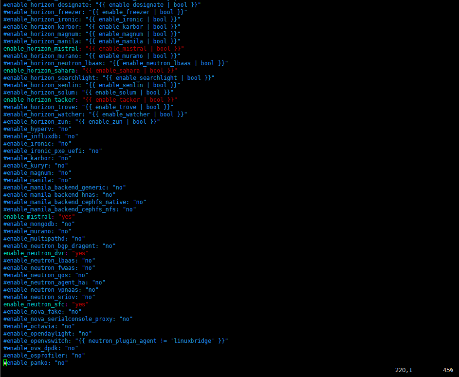

[TOC]
# kolla-ansible实战
最近研究kolla项目，主要是用容器来自动部署openstack组件。下面记录我在ubuntu下成功部署openstack-queens版本的过程。

目标： 尝试在一台物理机上利用kolla-ansible安装openstack-all in one环境。

虽然说官网也有文档，叫quickstart，但是如果刚接触kolla-ansible，然后看那个quickstart，可能需要碰一些壁。因为它有些内容省略了，这篇文档可以作为一个补充吧。

- 软件版本控制

|软件|查询命令| 版本|
|---|--|---|
|ubuntu|lsb_release -a |Ubuntu 16.04.4 LTS|
|docker|docker --version|Docker version 18.05.0-ce, build f150324|
|ansible|ansible --version|ansible 2.5.4|
|openstack|none|stable/queens|

## 基本步骤
### 安装操作系统
推荐 ubuntu16.04 server版本
如果只有14.04的镜像，可以尝试升级啊，因为手边只有ubuntu14.04的光盘，所以从14.04升级到16.04，然后再安装openstack。升级完成后，pip出了点问题，但是百度一下就解决了。
参考的网址：
https://blog.csdn.net/dylloveyou/article/details/78232656
### 其他软件依赖
```
apt-get update
apt-get install python-pip
pip install -U pip
apt-get install python-dev libffi-dev gcc libssl-dev python-selinux
```

### 安装ansible
如果用apt来安装，装的是2.0.0.2版本，而用pip安装，装的是2.5.4。建议用高版本的吧。pip会自动把apt装的低版本的ansible卸载掉，然后成功安装最新版本的ansible。
```
pip install -U ansible
```

### 安装docker
这里推荐用阿里云上的教程来下载docker-ce，最新版本即可
```
curl -fsSL https://get.docker.com | bash -s docker --mirror Aliyun
```
这个脚本有时候在晚上的时候无法执行，不知道为什么。下面提供一个详细版本的。一步步执行也能够成功安装
```
# step 1: 安装必要的一些系统工具
sudo apt-get update
sudo apt-get -y install apt-transport-https ca-certificates curl software-properties-common
# step 2: 安装GPG证书
curl -fsSL http://mirrors.aliyun.com/docker-ce/linux/ubuntu/gpg | sudo apt-key add -
# Step 3: 写入软件源信息
sudo add-apt-repository "deb [arch=amd64] http://mirrors.aliyun.com/docker-ce/linux/ubuntu $(lsb_release -cs) stable"
# Step 4: 更新并安装 Docker-CE
sudo apt-get -y update
sudo apt-get -y install docker-ce

# 安装指定版本的Docker-CE:
# Step 1: 查找Docker-CE的版本:
# apt-cache madison docker-ce
#   docker-ce | 17.03.1~ce-0~ubuntu-xenial | http://mirrors.aliyun.com/docker-ce/linux/ubuntu xenial/stable amd64 Packages
#   docker-ce | 17.03.0~ce-0~ubuntu-xenial | http://mirrors.aliyun.com/docker-ce/linux/ubuntu xenial/stable amd64 Packages
# Step 2: 安装指定版本的Docker-CE: (VERSION 例如上面的 17.03.1~ce-0~ubuntu-xenial)
# sudo apt-get -y install docker-ce=[VERSION]
```
安装加速器
```
sudo mkdir -p /etc/docker
sudo tee /etc/docker/daemon.json <<-'EOF'
{
  "registry-mirrors": ["https://j2ed47d8.mirror.aliyuncs.com"]
}
EOF
sudo systemctl daemon-reload
sudo systemctl restart docker
```
这里 **注意**，需要设置docker为mountflag=share(**文档里没有提，但是prechecks的时候会报错**)
测试下自己能不能正常使用docker hub
```
docker search kolla
```


### 下载kolla-ansble的源码
这里用developing的方式来安装openstack,所以直接下载源码
```
git clone https://github.com/openstack/kolla
git clone https://github.com/openstack/kolla-ansible
```

### 环境配置
将必须的文件拷贝到相应的地方，有两个文件比较重要
- /etc/kolla/*
global.yml以及password.yml
- /root/inventory/*
all-in-one以及multinode

```
cp -r kolla-ansible/etc/kolla /etc/kolla/
mkdir /root/inventory/
cp kolla-ansible/ansible/inventory/* /root/inventory/
```
然后修改配置文件
1. 修改/etc/host
添加自己主机名对应的ip地址。一般是用于rabbitmq。
2. 修改global.yml，除了修改自己的网络配置以外，如果要添加其他服务，可以enable一下相关的配置。在部署的时候会拉取对应的容器并启动提供相关服务。最好看官网上你需要的服务关联的配置。


3. 生成密码
    ```
    ./kolla-ansible/tools/generate_passwords.py
    ```
    如果自己想修改密码，可以修改/etc/kolla/password.yml文件。
4. 如果是多节点的话修改multinode
5. 安装一下requirement.txt里面的软件依赖 **(文档没有提，但是后面执行会报错)**
    ```
    pip install kolla-ansible/
    ```
### 基本环境检查
**记住**：prechecks成功不一定deploy成功，但是prechecks不成功deploy一定不成功
漫长的等待，如果哪里报错就根据提示修改
```
cd kolla-ansible/tools/
./kolla-ansible prechecks -vvv -i /root/inventory/all-in-one
```
### 执行部署
```
cd kolla-ansible/tools/
./kolla-ansible deploy -vvv -i /root/inventory/all-in-one
```

### openstack服务验证
生成对应的身份认证信息，配置命令行的环境。后面运行命令行的时候会用到。
```
kolla-ansible post-deploy
chmod +x admin-openrc.sh
. /etc/kolla/admin-openrc.sh
```
下面是安装client客户端，然后就可以愉快的用命令行了。另外还提供了一个脚本来测试openstack的服务。但是注意的是，这里创建的外部网络只是一个例子，不符合实际的网络配置，因此你还是要自己改一下子网。
```
pip install python-openstackclient python-glanceclient python-neutronclient
./init-runone
```
### 对容器进行运维
查看容器启动状态（UP/RESTART/DOWN...）
```
docker ps
```
查看镜像
```
docker images
```
debug 看日志
进入fluentd容器（日志集中的容器）
```
docker exec -it fluentd /bin/bash
cd /var/log/kolla/
```
然后要看的容器日志(举例：sahara_api)
```
tail -f sahara/sahara-api.log
```
退出fluentd容器
```
exit
```

修改配置文件，这里用root权限登录，没有密码没有密码没有密码！！！
```
docker exec -u -0 -it <容器名称> /bin/bash
docker exec -u -0 -it sahara_api /bin/bash
```
进入配置文件目录（一般是/etc/组件名称）
```
cd /etc/sahara/
```
找到对应的配置文件然后修改
我们还发现容器里面连文字编辑器都没有，由于用的是host网络，手动安装一下vim吧。
```
apt-get update
apt-get install vim
```
改完之后退出容器，然后重启这个容器
如果修改了ansible下的部署文件，用reconfigure可以避免将环境破坏掉，它会自动找到修改的容器，并且重新启动。
**reconfigure is VERY IMPORTANT!!!**

## 注意事项
1. 明确你需要安装的openstack版本
因为kolla是个开源的项目，因此不一定所有的版本都一直维护，一般只维护最新的三个版本，截止至目前（2018年6月)，可以看到kolla-ansible项目有4个分支，分别是master, queens, ocata和pike。如果要找回以前的版本，可以看回releases里面的内容。但是之前尝试想要复现Mitaka版本，但是失败了。这里提醒一句，M版本以及之前的版本使用的docker、ansible的版本与N版之后的有区别哦。并且kolla-ansible对于软件依赖的版本很敏感，很多时候安装失败都是因为软件的版本不对导致。
因此明确你要安装的版本，并且要将kolla-ansible切换到对应的分支，复制配置文件的时候最好也是用同一个版本的配置文件比较好。

2. 为什么用docker hub来下载镜像
我们这里不直接用kolla来构建镜像，而是从docker-hub中下载对应的镜像。当我尝试用kolla来构建镜像时，不但构建的时间很长，构建会出错，有几个镜像一直无法构建成功。然后通过`docker info`命令来查看镜像数量的时候多达三四百个。然而我们如果直接用从docker hub中拉取镜像，只会有我们要用到的镜像，镜像数量大大减小。后期通过`docker export`或者`docker save`将镜像导出即可，然后用于多节点部署，可以支持离线安装openstack。

3. 实战记录
|操作系统|方式|是否成功|
|-----|----|----|
|centos| all in one| yes|
|centos| multinode | yes|
|ubuntu| all in one| yes|
|ubuntu| multinode | 暂未尝试|

4. 尽管是stable分支，还是有bug的，要留心
比如说我们运行的一个sahara的组件，但是在horizon上就不能正常显示。后面通过debug发现原来部署的register.yml里面写错了，把service_name写错了，导致endpoint无法正确写入、从horizon的日志中看到的无法找到对应的endpoint。最后的解决方法是修改register.yml文件，然后重新reconfigure。
