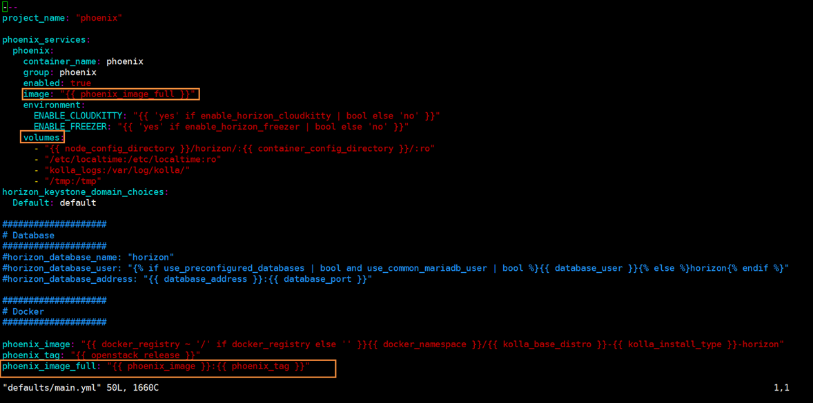

kolla项目中需要新增服务，这个服务可以是openstack新组件，也可以不是openstack的组件。根据需求，这里我需要添加一个非openstack组件的容器，并且让kolla能够在deploy命令时一起部署它，同时也可以利用ansible对他进行运维。
这里可以参考的资料比较少，主要还是靠自己摸索。
官网中提供了一个文档可供参考，文档简单地提及了加入一个openstack容器到kolla-ansible项目中的操作：
https://docs.openstack.org/kolla-ansible/latest/contributor/CONTRIBUTING.html

## 目标
在本地有phoenix容器的前提下，通过kolla项目的deploy命令，部署所有的容器(包括openstack组件的容器和phoenix容器)
背景介绍：phoenix容器是我们需要部署的一个容器，他非openstack组件，但是依赖于openstack的服务。我们希望能够在部署完openstack后也将这个容器一同部署，这样方便后期的运维。

## 工作概览
1. phoenix容器准备
2. 代码开发，也就是在kolla-ansible项目中添加相关的playbooks
3. 执行deploy
4. 后续工作

## phoenix容器准备
phoenix容器根据自己编写的dockerfile已经构建完成，我们可以通过`docker images`来查看镜像信息。

这里你可以替换成你自己的容器。
通过`docker export `以及`docker import`这两个命令，将容器打包，并转移到kolla主机上。
```
docker export container_id > phoenix.tar//Export a container's filesystem as a tar archive
cat phoenix.tar | sudo docker import - REPOSITORY:TAG
```
// docker save保存的是镜像包； docker export保存的是容器
```
docker save -o xxx.tar image_id
```
这里要注意的是，我们到容器导入的时候，最好设置repository和tag的命名方式参考kolla中的容器，因为它后面需要通过repository:tag来唯一标识一个容器。


## 代码开发
首先需要修改`site.yml`文件，这个是kolla-ansible项目的入口哦

然后呢，修改`all.yml`，全局的配置文件，主要是定义phoenix需要的端口，只要找个没有用过的端口即可。

接着，还要修改`/etc/global.yml`文件，这个文件的内容也可以在all.yml中找到。kolla-ansible将一些常常需要修改的变量放在这里，方便用户修改。

哦对了，还要修改修改ansible的inventory文件，决定了这个服务要安装在哪个节点上。
多节点部署配置文件`ansible/inventory/multinode` 和 单节点部署配置文件`ansible/inventory/all-in-one`.这里的语义是在control节点上安装phoenix组件
```
...
[phoenix:children]
control
...
```
紧接着，就来到了最重要的部分，也是主要的代码改动部分
每个openstack服务(这里也叫每个role)都拥有自己的文件夹目录，里面存储了对应操作的playbooks。我们的工作就是要加入phoenix项目的playbooks。

添加后对应的代码后

简单来说一下，defaults保存的是基本的一些变量信息，handler保存的是跟kolla-docker相关的play，task文件夹包含了对应操作的playbooks，templates储存了jinja2的文件，可以定制化不同的配置文件,然后在config.yml中将配置文件COPY到容器中。
`deploy.yml`通过include命令将其他yml文件包含进来，然后会按顺序执行
然后也会根据传入的action(比如deploy、prechek、reconfigure等)来调用不同的yml文件

`default/main.yml` 这里其实定义了怎么找到镜像的方式，如果本地没有，就会根据phoenix_image从仓库中获取，如果本地有，根据phoenix_image_full来获取，拼接的方式是仓库名:标签

最后，再来看看kolla怎么启动一个容器，下图是某个playbooks的内容

调用kolla_docker.py来执行docker的相关操作，这里用到了docker-py提供的接口

## 执行deploy
最后的最后，终于到部署这一步了。这里有一个小技巧，可以使用tools目录下的`validate-all-yaml.sh`脚本来检查自己写的yml文件，看看有没有出错。当然啦，precheck的时候也会报错。另外，如果deploy的时候想看详细的信息，可以加上参数-vvv，可以将debug的信息也打印出来，更好的找到问题。
我们按照之前那样进行部署
```
./kolla-ansible deploy -i /inventory/all-in-one
```
可以看到phoenix容器已经启动起来了

但是呢，启动的命令是kolla_start，实际上覆盖了我们dockerfile里面的CMD或者RUN命令的内容，因此还需要做进一步的开发


## 后续工作
1. Kolla start 是统一的启动命令CMD，但对于phoenix来说它应该是要执行cmd.sh，要继续进行开发
2. 端口问题(改openstack组件的还是改phoenix的)
3. 测试各项服务是否正常启动
4. 容器添加的问题(暂时先用export、import)


## 修改phoenix容器
将phoenix-base拷贝到另一台主机，然后进行docker build，想要制作vinzor-dit，但是报错了诶

