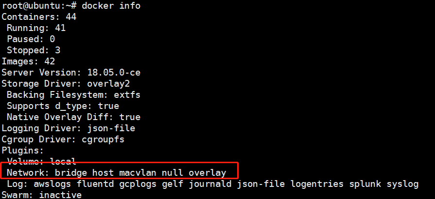
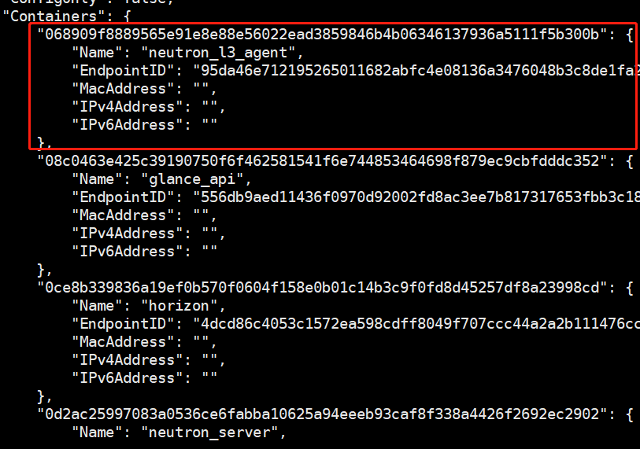
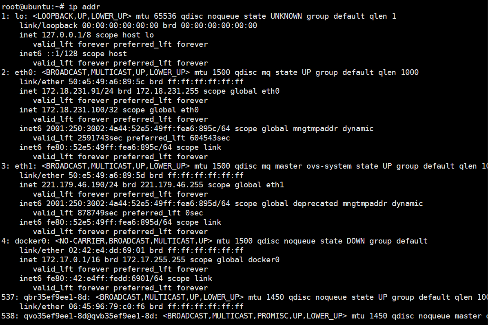
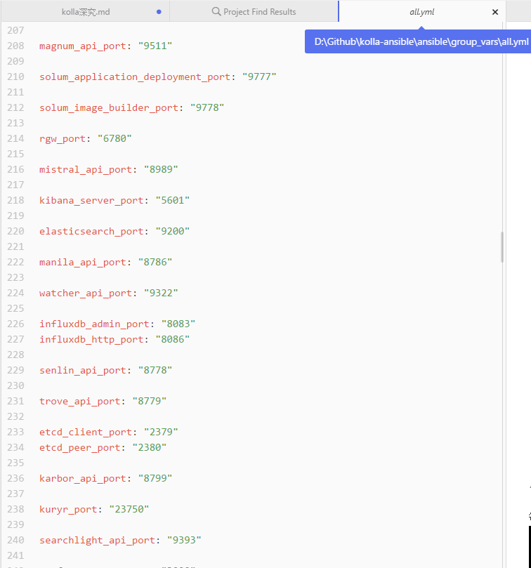
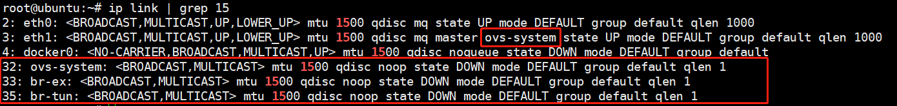
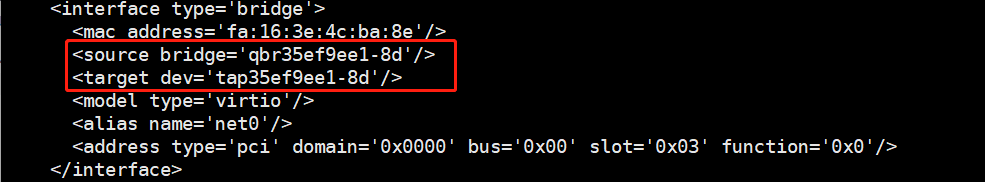
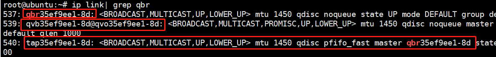
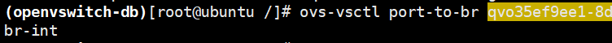
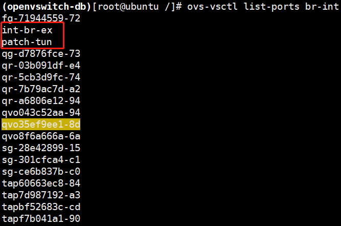

# 网络虚拟化
[TOC]
在kolla中所有的容器都是选用最简单的host网络，网络配置同在物理机上是一样的
##证据
```
docker info
```


除了none、host、bridge三个自动创建的网络，用户也可以根据自己的需求创建user-define网络：bridge、overlay、macvlan。overlay和maclan用户创建跨主机的网络。bridge自己创建网桥，可以自己指定分配的ip网段
```
docker network inspect host
```

```
docker inspect glance_api
```

连接到host网络的容器共享docker host的网络栈，容器的网络配置与host完全一样，可通过`--network=host`来指定使用host网络
在容器里看网络配置和在服务器上看网络配置是一样的



## 优点
a. 性能，容器对网络传输效率有较高要求的话一般会选择host网络。不便之处就是损失一些灵活性，比如要解决端口冲突的问题。kolla-ansible项目中将所有的端口固定写好在一个配置文件`all.yml`中，部署之前会precheck一下，确认所有的这些端口都是空闲的才会进行下一步的deploy。

b. 让容器可以直接配置host网络，比如neutron组件会创建虚拟网桥等实现网络虚拟化，会直接作用在host主机上。

## ovs分析

首先列出跟neutron相关的容器以及相关的进程。


 - **neturon server**:对外提供openstack网络api，接收请求，并调用plugin处理请求
 - **plugin**：处理neutron server发来的请求，维护openstack的逻辑网络状态，并调用agent处理请求
 - **agent(openvswitch/l3/dhcp)**:处理plugin的请求，负责在network provider上真正实现各种网络功能
 - **network provider**：提供网络服务的虚拟或物理网络设备，例如linux bridge、open vswitch或者其他支持neutron的物理交换机
 - **queue**：neutron server、plugin和agent之间通过messaging queue通信和调用
 - **database**：用于存放openstack的网络状态信息，包括network、subnet、port、router等。

首先看配置文件中跟neutron相关的配置。


除了Neutron本身命令外，还包括了Linux Bridge的brctl命令；OpenvSwitch的ovs-vsctl、ovs-ofctl命令和L3的NameSpace的ipnetns等命令。
查看关于bridge的信息，可以查看tap的id和网桥qbrxxxx


eth0连接的目的设备是：tap35ef9ee1-8d，别名为net0；tap8f6a666a-6a，别名为net1。TAP设备桥接到网桥qbrXX上（都由Linux kernel创建）。qbr设备是因为不能在TAP设备上配置iptables实现安全组（SecurGroup）而增加的设备。


从虚拟机开始分析，tap->qbr->qvb->qvo->br-int->br-ex/br-tun
查看虚拟机的xml描述文件

查看主机上创建的linux网桥

查看ip link的输出信息，可以看到qbr上连接了tabxxx和qvoxxx

qvoxxx上连接了br-int网桥

然后br-int上连接了多个接口和其他网桥，如br-tun，br-ex。这里的qr指的是类型为internal的网络.br-int还会连接router和dhcp上的端口。

结论：从分析中可以看到容器部署openstack后，neutron进行网络虚拟化的方式跟传统的方式没有太大的差异。关键在于容器中用了host网络。
