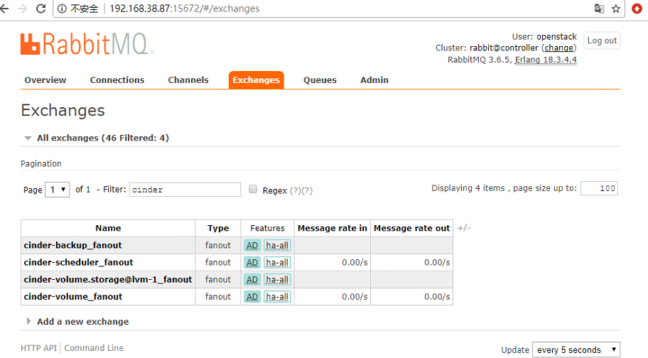
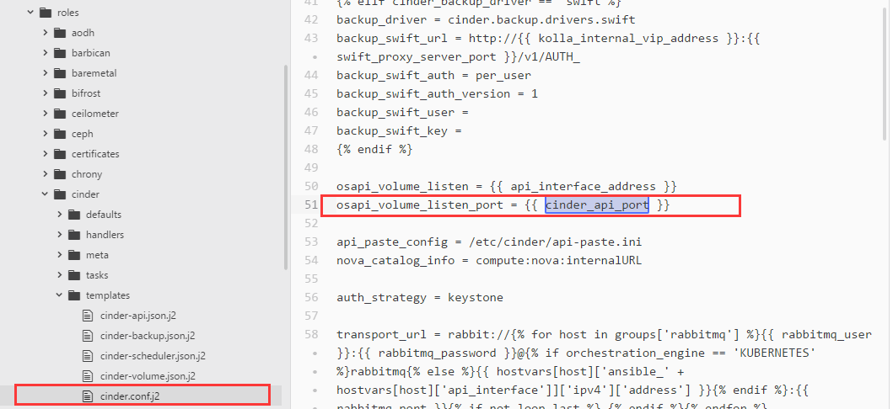

[TOC]

## KOLLA项目中容器通信探究
一直以来容器通信都是软肋，涉及到数据安全性和服务可靠性。而kolla项目中的容器多达32个，因此很有必要搞清楚这些容器之间是怎么通信的，如何进行消息传输从而提供openstack服务。
网上搜索后发现很少相关的信息，因此自己不断地摸索来找答案。
摸索的思路是这样子的：
**首先** 看容器之间的通信方式，这里又分为单主机容器之间的通信以及跨主机容器之间的通信，因为我们openstack云操作系统是多节点部署的，每个节点上都有多个容器，因此既会用到单机容器通信也会用到跨主机的容器通信。
**然后** 再看openstack组件之间和组件内部的通信。kolla将每个组件又做了一次划分，将每个组件中的服务划分为一个容器，这就涉及到openstack组件里的各个服务如何通信。
**最后** 结合kolla-ansible源码以及多节点部署的实际环境进行分析。在容器构建的时候应该会有容器网络构建的细节，可以从这里进行挖掘。


### 容器之间的通信方式
#### 单主机容器通信
默认采用bridge的方式，通过linux bridge等方式转发或者数据包的拆封。安装docker的时候会创建一个docker0的网卡，所有容器都是会经过docker0来发出数据。
每个容器启动的时候会随机分配一个ip，ip段即为docker0的配置(网关、掩码、ip段等)。
基于net namespace，docker可以为容器提供隔离的网络环境，在隔离的网络环境找那个可以使容器共享主机或者其他容器的网络命名空间，基本满足在各个场景下的需要。
**五种模式**
1. bridge模式：我们创建一个新的容器时，容器通过DHCP获取一个与docker0同网段的IP地址，并默认连接到docker0网桥
劣势：与外界通信的时候会占用宿主机的端口，可能会出现与宿主机进行竞争端口资源。需要对宿主机端口进行管理。另外容器与外界通信是基于三层上的iptables NAT，性能和效率有损耗。
2. host模式：直接使用容器宿主机的网络命名空间，没有独立的网络环境，使用宿主机的ip和端口
劣势：容器不再拥有隔离、独立的网络栈。容器会与宿主机竞争网络栈的使用，并且容器的崩溃就可能导致宿主机崩溃。另外容器不再拥有所有的端口资源，因为有些端口已经被主机服务、bridge服务绑定端口等其他服务占用了。
3. none模式：为容器创建独立网络命名空间，但不为它做任何网络配置，容器中只有lo，用户可以在此基础上，对容器网络做任意定制。这个模式下，dokcer不为容器进行任何网络配置。需要我们自己通过第三方工具或者手工方式为容器添加网卡，配置IP。提供最高的灵活度。
因此，若想使用pipework配置docker容器的ip地址，必须要在none模式下才可以。
4. container模式：容器与指定容器共享网络命名空间，但其他不共享，比如文件系统，进程等还是隔离开的。
5. 用户自定义：docker1.9以上支持，允许容器使用第三方的网络实现或者创建单独的bridge网络，提供网络隔离能力
在用户定义网络模式下，开发者可以使用任何docker支持的第三方网络driver来定制容器的网络。并且，docker 1.9以上的版本默认自带了bridge和overlay两种类型的自定义网络driver。可以用于集成calico、weave、openvswitch等第三方厂商的网络实现。bridge driver的所有行为都和默认的bridge模式完全一致。而overlay及其他driver，则可以实现容器的跨主机通信。

**两种简单的方式**
- 端口映射
-p 主机端口：容器端口
- link方式：会在源和接收容器之间创建一个隧道，接收容器可以看到源容器指定的信息。
--link 容器名：别名

**例子分析**
- 主机与容器--主机可以ping通容器ip， 容器内可以ping通主机ip
- 外网与容器--一般采用端口映射的方式，外网访问的时候，可以访问主机ip:主机端口，实际上是访问容器ip:容器端口，这样就不必关心容器ip的端口是什么
- 容器与容器--容器A可以ping通容器B的ip，反之也成立，都是默认连接到docker0网桥。但因为每次容器启动ip就会改变，因此docker提供link方式，指定要和哪个容器通信。docker会在iptable中添加一条ACCEPT规则，允许相互访问开放的端口(EXPOSE)。
查看/etc/hosts文件会看到域名解析，根据容器ip动态变化而变化。


#### 跨主机容器通信

**通信方案**
- 端口映射
将宿主机A的端口P映射到容器C的网络空间监听的端口P’上，仅提供四层及以上应用和服务使用。这样其他主机上的容器通过访问宿主机A的端口P实 现与容器C的通信。显然这个方案的应用场景很有局限。

- 网桥实现：实现容器跨主机访问，最简单的方式就是将不同主机的docker0 设置为同一网段。
所有网卡在同一个网段下，要对每个docker守护进程的ip分配做出限制。
步骤：
    对容器ip进行划分，通过CIDR。不使用默认的网桥，自己新建一个网桥
    1. 在各自的docker宿主机上建立虚拟网桥
    2. 为网桥分配同一个网段ip
    3. 桥接本地网卡
    4. 修改docker配置，用新建的网桥代替docker0
    5. 添加守护进程的启动选项
    6. 保存并重启docker服务

- Open vSwitch
OVS是一个虚拟交换软件，目的是让大规模网络自动化可以通过编程扩展。
条件：1. 双网卡 Host-Only && NAT 2. 安装Open vSwitch
步骤：
    1. 在虚拟机中建立ovs网桥
    2. 添加gre连接
    3. 配置docker容器虚拟网桥
    4. 为虚拟网桥添加ovs接口
    5. 添加不同Docker容器网段路由

- weave
建立一个虚拟的网络,用于将运行在不同主机的Docker容器连接起来.
要实现这种方式所需要的条件如下:
双网卡,Host-Only & NAT

参考链接
https://blog.csdn.net/canot/article/details/52895897


最近看《第一本docker书》，作者从另一个角度将docker中的网络连接分为以下三类
最常见的方法就是公开端口并且绑定到本地网络接口中，这样可以把容器的服务在本地docker宿主机所在的外部网络上公开。
- docker 内部联网，这种方法涉及到docker自己的网络栈。
安装docker的时候会创建一个新的网络接口docker0，每个docker容器启动时会在这个接口上分配一个ip地址（每次重启后ip可能发生变化）。docker0是一个虚拟的以太网桥，用来连接容器和宿主机网络。
docker每创建一个容器，会创建一组互联的网络接口，这组接口的一端连着容器的eth0接口，另一端连着docker0的网桥。接口一般命名为veth*。Docker创建一个虚拟子网，这个子网由宿主机和所有Docker容器共享。
- docker networking，容器之间的连接用网络创建，允许用户创建自己的网络，容器可以通过这个网上互相通信。docker networking用新的用户管理的网络补充了现有的docker0.并且容器可以跨越不同的宿主机来通信，网络配置更加灵活定制。`/etc/hosts`文件存储容器的ip地址映射，如果器的ip更新了会自动更新这个文件
    ```
    docker network ls //查看docker网络。
    docker network create app //创建app网络。默认为bridge类型。
    docker network inspect app //查看app网络的具体配置信息。
    docker network connect app db2 //将已有的容器添加到app网络。
    docker run -d --net=app --name db jamtur01/redis //-net参数设置容器网络
    ```

- docker 链接，其实就是上面提到的--link 的方式，有一定安全上的好处，没有用-p标志公开端口，通过链接可以让客户容器直接访问任意服务容器的公开端口，只有使用--link标志链接到这个容器的容器才能连接到这个端口，容器端口不需要对本地宿主机公开。可以限制容器化应用程序被攻击面，减少应用暴露的网络。
    ```
    sudo docker run -p 4567 \
    --name webapp --link redis:db -t -i \
    -v $PWD/webapp_redis:/opt/webapp jamtur01/sinatra \
    /bin/bash
    ```

### openstack组件通信
OpenStack 各组件之间是通过 REST 接口进行相互通信，而各组件内部则采用了基于 AMQP 模型的 RPC 通信等方式。
**REST** 全称是Representational State Transfer，表现状态传输。通过操作资源的表现来操作资源的状态。
我们用的是基于HTTP协议实现的RestFul WebAPI，对资源的操作包括获取、创建、修改和删除，对应于HTTP请求的GET、POST、PUT和DELETE。
有三点比较重要：
1. 资源地址和资源的URL
2. 传输资源的表现形式（json、xml...）
3. 对资源的操作

**openstack 组间的通信方式**
1. 基于HTTP协议进行通信
2. 基于高级消息队列协议通信（RABBITMQ等）
虽然大部分通过 AMQP 协议进行通信的组件属于同一个项目，但是并不要求它们安装在同一个节点上，给系统的横向扩展带来了很大的好处，可以对其中的各个组件分别按照他们负载的情况进行横向扩展，因为他们不在一个节点上，分别用不同数量的节点去承载它们的这些服务。
3. 基于SQL的通信（中间频繁的读写数据库）
4. 通过NATIVE API实现通信（出现在openstack组件和第三方软硬件之间，比如cinder和存储后端之间、nova与hypervisor或者libvirt之间）

**AMQP** 全称是Advanced Message Queuing Protocol，高级消息队列。
- exchange：根据routing key转发消息到对应的message queue
- routing key：用于exchange判断哪些消息要发送到对应的message queue
- publisher：消息发送者，将消息发送给exchange，并指明routing key
- consumer：消息接收者，从message queue中获取消息


以cinder为例子分析

- **API前端服务**：api服务负责接收客户请求，作为组件对外的唯一窗口，向客户暴露cinder能够提供的功能。如果客户需要执行跟volume相关的操作，能且只能向cinder-api发送REST请求。
- **scheduler调度服务**：对于某项操作，有多个实体能够完成任务，那么通常有一个scheduler负责从这些实体中选一个最合适的来执行操作。这里具体分析就是存在多个存储节点，当需要创建volume时，cinder-scheduler会根据存储节点的属性和资源使用情况选择一个最合适的节点来创建volume。
- **worker工作服务**：真正执行任务的服务。这里具体分析就是cinder-volume。
scheduler和worker从职能上分工让openstack服务非常容易拓展。当存储资源不够时可以增加存储节点（增加worker），当客户的请求量太大调度不过来的时候，可以增加scheduler。

接着去看下rabbitmq上的记录，有助于更好的理解openstack中基于高级消息队列协议通信的实现：
主要看三个部分：queue，connection和exchange。
这里的exchange一共有5条，exchange分为三类，一种是direct模式（这里暂时没有看到），一种是fanout广播模式，一种是topic模式


这里查看了所有与cinder相关的queue队列。


每个exchange会绑定一个或者若干个queue。如果是fanout类型的exchange一般绑定一个队列，而topic类型的exchange绑定了若干个队列。

最后再来看一下connection，这里截图的是cinder-volume与rabbitmq建立的连接。两者不是在同一个主机上，因此可以看到对应的ip也不同，统一发送到rabbitmq指定的端口上。

### kolla-ansible源码
可以看到在all.yml中，定义了各个服务的访问端口。作为group_var文件下的配置文件，这些变量在构建CONF文件时可以调用。类似{{ cinder_api_port }}即可访问。

在构建容器过程中，main.yml-deploy.yml-config.yml，在templates/文件夹下有所有配置文件的jinja2模板，config.yml文件主要就是定制化所有的conf文件，并将他们复制到指定的位置。让容器服务启动时能够直接使用到这些配置文件。

### 多节点部署的实际环境
首先查看docker network，发现有三种类型的docker网络。依次看具体的网络配置

可以看到类型为host的网络，里面的containers参数表示运行该网络的容器，我发现所有的容器都是用的host网络。也就是跟宿主机共享网络栈。

同理查看计算节点和存储节点，也是一样的情况。因此我们可以知道，kolla项目中的容器是通过host模式的网络进行通信。


总结：
简单来说，kolla项目中的openstack服务划分为一个个容器，每个容器用的网络模式是host模式，与宿主机共享一个网络栈，因此我们在容器里相关的CONF配置文件中规定了暴露的端口后，对应的就是宿主机暴露的端口，与原来的openstack通信没有太大的差异。
