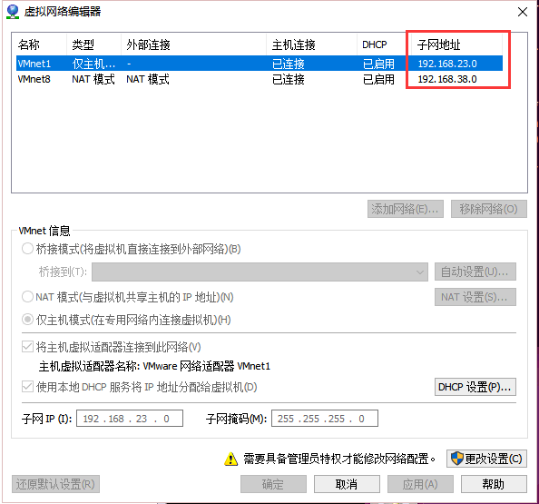

1. 安装操作系统ubuntu16.04
2. 设置静态ip

ubuntu设置静态ip，修改文档`/etc/network/interfaces`
```
/修改模板
auto eth0
iface eth0 inet static
address 192.168.8.100    
netmask 255.255.255.0
gateway 192.168.8.2
dns-nameserver 119.29.29.29
```
3. 设置网络代理
不详述
4. 安装docker社区版、最新版
```
curl -sSL https://get.docker.io | bash
docker --version
```
安装特定版本的docker
参考 https://blog.csdn.net/csdn_duomaomao/article/details/74533968
