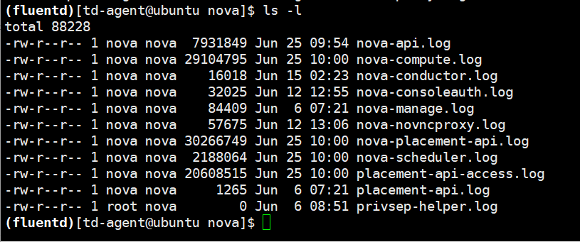

# kolla 探究
[TOC]

## image存储方式（基础镜像、普通镜像存储位置）（磁盘io）
m版本的存储方式：基础（mount，ssd），普通（raid）、放在服务器操作系统上
**glance-api** 是系统后台运行的服务进程，对外提供rest-api，响应image查询、获取和存储的调用，不会真正处理请求
**glance-registry** 处理与image metadata（元数据）相关的操作
**store backend** 处理与image自身存取相关的操作


`/etc/kolla/glance-api/glance-api.conf`

在服务器操作系统上没有找到相关的文件

然后进入到glance-api这个容器查看相关的文件


每个image在目录下对应有一个文件，文件以image的id命名
删掉镜像（cirros和ubuntu）和实例之后，好像docker images的size没什么变化。那么ubuntu的2.7G存在了哪里呢？？


查看container的大小
    ```
    cd /var/lib/docker/containers
    du -sh *
    ```
    根据containeer-id来获取container的名称。

种种迹象证明镜像应该不是存储在容器中的。
```
docker inspect glance_api
```

然后我们去查看服务器上的对应目录，应该是用了一个卷挂载的方式，glance_api容器里面的`/var/lib/glance/images`对应服务器上的`/var/lib/docker/volumes/glance/_data/images`

同理，我还查看了nova相关的卷挂载


## 性能稳定性

1. 判断服务是否正常启动，容器状态和服务状态

查看容器的信息


怎样判断UP状态？[查看代码]
docker只能通过容器启动进程的返回代码来判断其状态，而对于容器内部应用的运行情况基本没有了解。
执行docker run命令时，会根据dockerfile中的额cmd或者entrypoint启动一个进程，这个进程的状态就是docker ps status列显示的容器状态。
UP：容器正在运行
Exited(0)：容器已经停止
Exited(137)、Exited(1):因为某些故障停止了，退出代码非0


这里我尝试进入了glance_api这个容器，然后查看它的进程。一旦我kill到1或者7进程，容器就会立刻重新启动（why——重启策略）


restart机制

可以看到这里的restart机制选择了`unless-stopped`,也就是说它的重启策略是在容器退出时总是重启容器，但是不考虑在Docker守护进程启动时就已经停止了的容器。如果你自己手动停止了这个容器，那么这个重启策略不会生效。

2. 日志查看 (如何集成）
分别在fluentd容器以及nova-api容器以及glance-api容器中同时查看同一个日志文件nova-api.log



我们看nova这个目录下的日志，是同时更新并且内容一致。也就是说不仅仅在fluentd这个目录下可以看所有容器的日志，而是所有容器里都同时更新日志。从更新的时间上看，首先写入的是fluentd这个容器，然后再复制其他容器中。[看具体代码]
这里其实用到了docker存储，data volume中的docker managed volume来存储数据

对于每一个容器进行inspect查看容器信息，可以看到都挂载了这个volume，也就是说如果其中一个容器的mount源修改了，也会直接影响到各个容器里面的日志信息。因此我们可以在任意一个容器查看当前所有openstack服务的日志。
3. 重启服务
在kolla中我们将每一个openstack服务划分成多个进程，每一个进程都会在单一的一个容器中运行。那么我们重启容器就相当于重启一个进程，进而重启了openstack的服务。
目前kolla-ansible提供的是手动重启某个容器，提供的tools中也没有重启单一容器的命令。

4. 配置文件（如何集成）
 Ansible Inventory，它是一个组的概念，通过它，我们可以知道哪个机器在运行哪个服务。现在支持单机的部署，其实单机跟多机是一样的，只是 Inventory 的文件内部不一样，不仅如此，还支持MariaDB和RabbitMQ集群，同样是自动创建的。
 1. 首先在部署的主机上会根据模板和填写了配置信息的文件生成每个project的配置文件（一般不止一个，以project为单位放在一个文件夹里），配置文件放置在`/etc/kolla/{project}`目录下
 
 2. 当我们开始部署的时候，会执行`config.yml`这个playbook的内容（这里以glance-api为例）
 
 - 确保建立了配置文件的目录
 - 将相应的配置文件复制到对应的目录下
 - 检查容器状态、重启容器
 

## 从虚拟机的角度，如何实现虚拟化
1. cpu虚拟化
一个kvm虚拟机在容器中是一个qemu-kvm的进程，与其他linux进程一样被调度。

2. 内存虚拟化
KVM通过内存虚拟化共享物理系统内存，动态分配给虚拟机
KVM实现VA（虚拟内存）-PA（物理内存）-MA（机器内存），虚拟OS不能直接访问实际机器内存，因此KVM需要负责映射客户物理内存到实际机器内存。
3. 内存虚拟化
通过storage pool和volume来管理
storage pool是宿主机上可以看到的一片存储空间，可以是多种类型
volume是storage pool中划分的一块空间，宿主机将volume分配给虚拟机，在虚拟机上看volume就是一块硬盘。
4. 网络虚拟化
所有的容器都是选用最简单的host网络，网络配置同在物理机上是一样的
**证据**：
    ```
    docker info
    ```
    除了none、host、bridge三个自动创建的网络，用户也可以根据自己的需求创建user-define网络：bridge、overlay、macvlan。overlay和maclan用户创建跨主机的网络。bridge自己创建网桥，可以自己指定分配的ip网段
    
    ```
    docker network inspect host
    ```
    
    ```
    docker inspect glance_api
    ```
    
连接到host网络的容器共享docker host的网络栈，容器的网络配置与host完全一样，可通过`--network=host`来指定使用host网络
在容器里看网络配置和在服务器上看网络配置是一样的


**优点**：
a. 性能，容器对网络传输效率有较高要求的话一般会选择host网络。不便之处就是损失一些灵活性，比如要解决端口冲突的问题。kolla-ansible项目中将所有的端口固定写好在一个配置文件`all.yml`中，部署之前会precheck一下，确认所有的这些端口都是空闲的才会进行下一步的deploy。

b. 让容器可以直接配置host网络，比如neutron组件会添加网卡之类的？

首先列出跟neutron相关的容器以及相关的进程。


neturon server:对外提供openstack网络api，接收请求，并调用plugin处理请求
plugin：处理neutron server发来的请求，维护openstack的逻辑网络状态，并调用agent处理请求
agent(openvswitch/l3/dhcp):处理plugin的请求，负责在network provider上真正实现各种网络功能
metadata
network provider：提供网络服务的虚拟或物理网络设备，例如linux bridge、open vswitch或者其他支持neutron的物理交换机
queue：neutron server、plugin和agent之间通过messaging queue通信和调用
database：用于存放openstack的网络状态信息，包括network、subnet、port、router等。
首先看配置文件中跟neutron相关的配置。


除了Neutron本身命令外，还包括了Linux Bridge的brctl命令；OpenvSwitch的ovs-vsctl、ovs-ofctl命令和L3的NameSpace的ipnetns等命令。
查看关于bridge的信息，可以查看tap的id和网桥qbrxxxx


eth0连接的目的设备是：tap35ef9ee1-8d，别名为net0；tap8f6a666a-6a，别名为net1。TAP设备桥接到网桥qbrXX上（都由Linux kernel创建）。qbr设备是因为不能在TAP设备上配置iptables实现安全组（SecurGroup）而增加的设备。


从虚拟机开始分析，tap->qbr->qvb->qvo->br-int->br-ex/br-tun
查看虚拟机的xml描述文件

查看主机上创建的linux网桥

查看ip link的输出信息，可以看到qbr上连接了tabxxx和qvoxxx

qvoxxx上连接了br-int网桥

然后br-int上连接了多个接口和其他网桥，如br-tun，br-ex。这里的qr指的是类型为internal的网络.br-int还会连接router和dhcp上的端口。


## 从容器的角度
**每个容器中只有一个进程**


**容器存储**
这里没有用默认的driver：aufs，而是用了overlay2，而底册文件系统是extfs，各层数据存放在`/var/lib/docker/overlay2`下


overlay2是个什么东西
本质区别是镜像层之间共享数据的方法不同
overlay共享数据方式是通过硬连接
而overlay2是通过每层的 lower文件，逐层挂载

可以看到第二层和第三层的lower文件逐渐递加，有相同的部分


docker为容器提供了两种存放数据的资源
- storage driver管理的镜像层和容器层
    - 镜像分层，容器由一个可写的容器层以及若干只读的镜像层组成，容器的数据存放在这些层中。最大的特点是copy-on-write。新数据直接存放在最上层的容器层，修改现有数据会先从镜像层将数据复制到容器层，修改之后直接保存在容器层；如果多个层有命名相同的文件，用户只能看到最上面那层中的文件
    - 分层结构使镜像和容器的创建、共享和分发变得非常高效，依赖与docker storage driver。实现了多层数据的堆叠并为用户提供一个单一的合并之后的统一视图。
    - 多种storage-driver：aufs，device mapper，btrfs，overlayfs，vfs和zfs

- data volume：一般适用于有持久化数据需求的情况，容器启动时需要加载已有的数据，容器销毁时希望保留产生的新数据，也就是说这种容器是有状态的。
    - 本质上是docker host文件系统的目录或文件，能够直接被mount到容器的文件系统中。
    - 特点：1. data volume是目录或文件，而非没有格式化的磁盘 2. 容器可以读写volume中的数据 3. volume数据可以永久被保存，即使容器销毁
    - 目前还没有方法设置volume的容量，它取决于文件系统当前未使用的空间
    - 两种类型：bind mount（让host和容器共享数据，即使容器没有了，bind mount也还在，bind mount是host文件系统中的数据，只是借用给容器；bind mount还可以设置制定数据的读写权限，ro是指容器无法对bind mount数据进行修改，只有host有权修改，不足在于bind mount要指定host文件系统的特定路径，限制了容器的可移植性，当迁移到其他host并且该host没有要mount的数据或者数据在其他路径的话，操作会失败）和docker managed volume（不需要指定mount源，指明mount point即可）
    
    每当申请mount docker managed volume时，docker会在`/var/lib/docker/volumes/kolla_log/_data`下生产一个目录，这个目录就是mount 源
    
    
    因为mount point指向已有的目录，原有的数据会被复制到volume中。此时，容器中的`/var/log/kolla/`已经不再是由storage driver管理的层数据了，他是一个data volume，可以对数据进行操作，例如更新数据等。
    可以通过`docker volume ls`来查看docker managed volume，但看不到bind mount；同时也无法看到volume对应的容器。
    
    

数据共享
- bind mount：直接将要共享的目录mount到容器中
- docker managed volume，由于volume在host中的目录，实在容器启动时才生成，所以需要将共享数据复制到volume中。 当你修改容器中的volume时，host的目录也会变化；同理，当你修改host的mount源目录下的内容，容器中的volume也会变化。
## Kolla能否集成新的容器
比如一起部署管理系统的容器（200-300M）？


## kolla如何控制 docker


## 可视化
如何看性能
同一个硬件条件下，不同版本同时重启，时间花费；同时开启50台虚拟机再到ping通，时间花费


## 部署节点能否在公网部署 多个集群部署?
