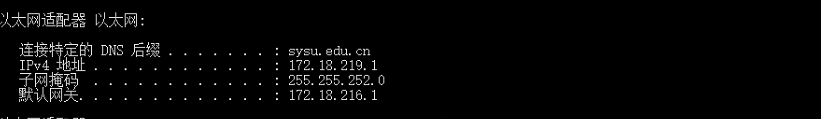
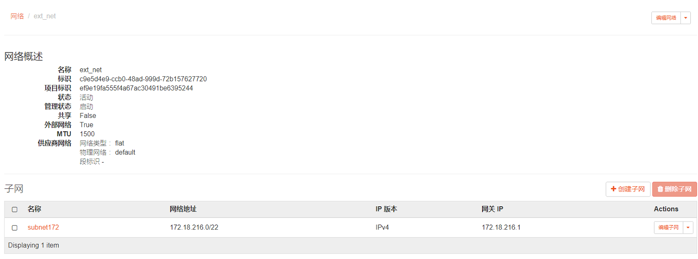
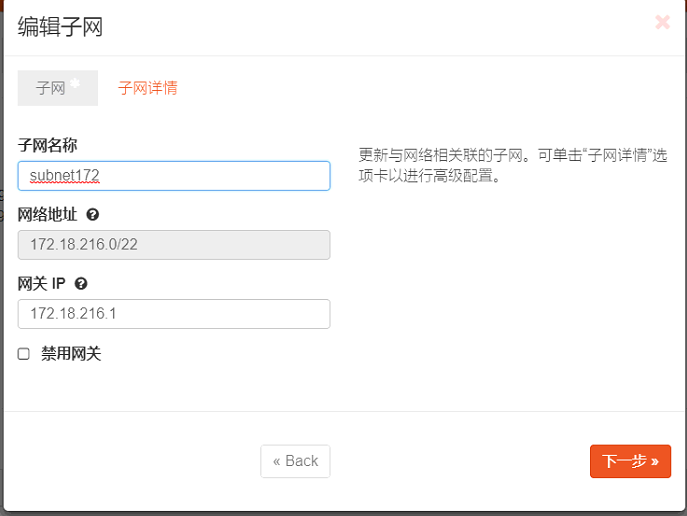
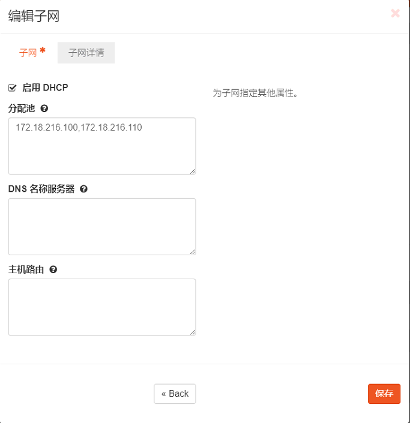
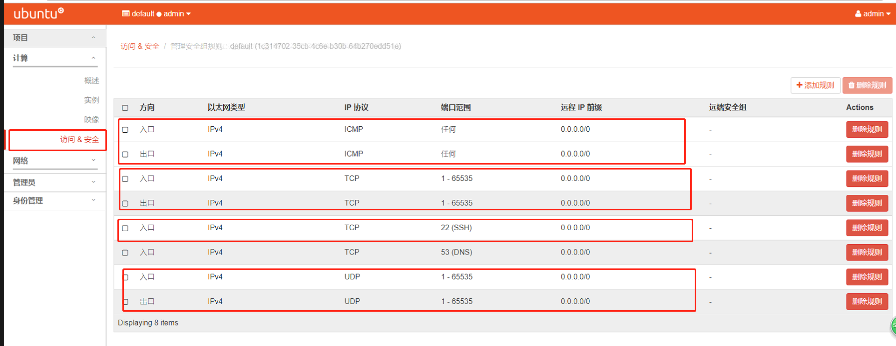
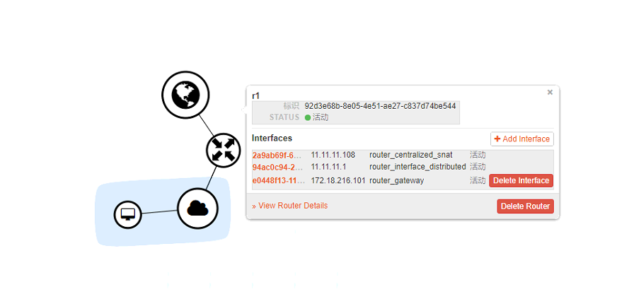
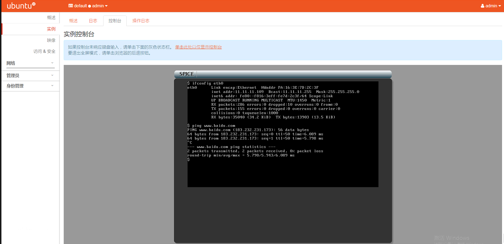
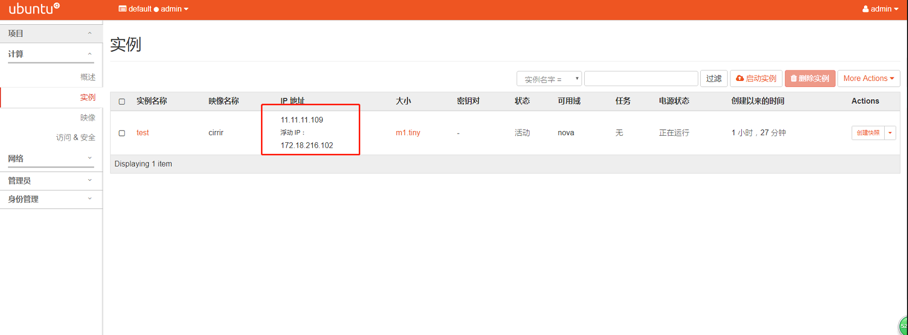
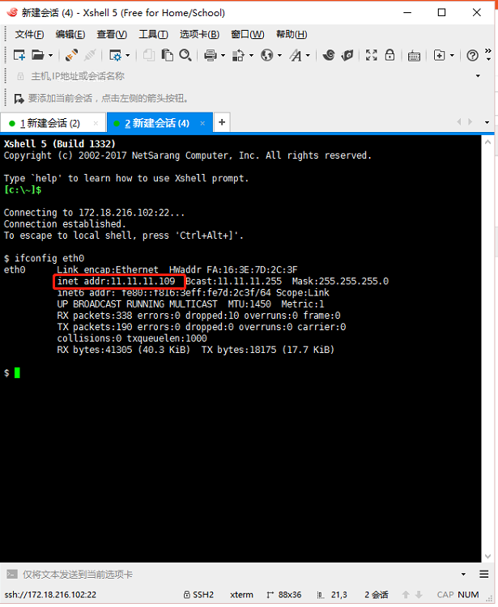

外部网络
外部可访问的接口
管理网络
endpoint
public endpoint

可以两个网卡可以用同一个网段

## 背景：
用vmware创建虚拟机，操作系统选择ubuntu14.04.5，创建了两个虚拟网卡，管理网卡选择了NAT模式，外部网卡选择了仅主机模式。

## 问题描述：
用集成脚本成功搭建openstack环境后，创建的实例无法上网

## 解决方案：
1. **作为外部网卡的网络适配器不应该选为仅主机模式。** 之前只想着两个网卡的网络要隔离，选择了两个不同的网段，但是一旦要考虑到实例连接物理网络，首先需要这个外部网卡能够连接物理网络。因此，将作为外部网卡的虚拟网卡设置为桥接模式（复制物理网络连接模式）是最简单的解决方式。
另外： “NAT模式”物理机上测试是成功的，但要开混杂模式。。我尝试在vmware里面用命令行开启混杂模式，但是，实例仍然无法连接物理网络，应该是vmware本身的问题，建立的虚拟网卡不支持混杂模式，即使你在虚拟机内开启了混杂模式。[如果有尝试成功的可以分享下经验]

2. 如果仍然不能上网，可能是**桥接模式没有启动成功**。建议尝试关闭无线网卡、virtualbox建立的虚拟网卡等。查看vmware-编辑-虚拟网络编辑器，vMnet0表示的就是桥接模式。一般开启成功会有显示。

3. **外部网络的创建也要注意**
首先需要查看本地物理网络配置，我的物理网络是这样子的(是开启dhcp模式的)：

那么在创建外部网络的时候，需要参考这样的一个网络配置。

要注意的是，如果外部网络的配置填写错误的话，也有可能导致上不了网。具体的配置内容还需要根据自己电脑物理网络来。

4. 如果你修改了外部网络的内容，此时最好是**对路由器清除网关** ，然后再重新设置网关，确保你外部网络的配置修改生效了。

5. 还是不能上网，查看自己的安全组设置

安全组设置有点像ip-table，设置入口和出口，这里主要需要设置的是TCP/ICMP/UDP等。

6. 一般来说，我们测试自己网络问题可以这样来测：

实例连接在内部网络vxlan100，分配了浮动ip。当ping外部域名不成功时，尝试下ping域名对应的ip地址，排除dns问题。如果不是dns的问题，再逐步分析的方法来检验自己的网络问题，首先ping内网网关、然后ping浮动ip，再ping外部网络的网关，ping外部网络的子网网关。这样子逐步排查，看是哪个地方出了问题。

7. 不能ping通网络也有可能**是DNS的原因** 。排查方式如下：
a. 尝试`ping www.baidu.com`，查看报错信息
b. 尝试`ping $BAIDU_IPADDR`，尝试直接ping百度的ip
    如果ping通了，说明就是dns的问题，这时候你可以去改`/etc/resolv.conf`,修改nameserver的值，尝试改成了`10.8.8.8`或其他DNS服务器（具体可以参考因为dns无法上网的解决方案）
    如果ping不通，应该还不是dns的问题，找找其他原因。

8. 实例连接物理网络测试：

9. 利用xshell连接实例测试：

