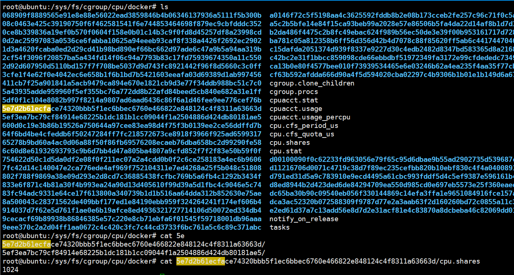
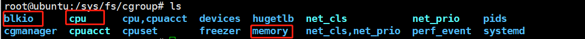
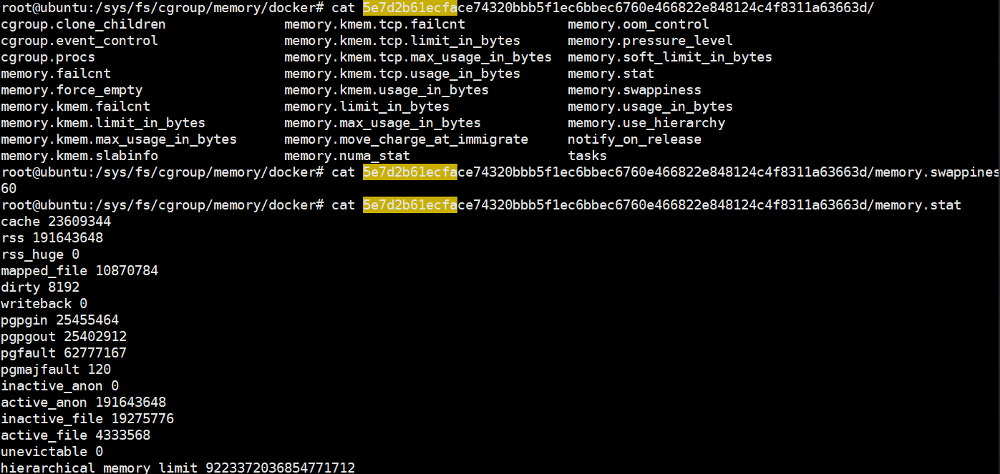
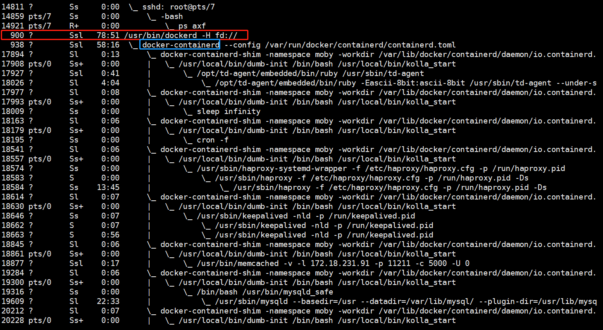

对于容器的了解需要知道他的底层实现技术。
- cfgroup：实现资源限额
- namespace：实现资源隔离
## cgroup
全称：control group, linux操作系统通过cgroup设置进程使用CPU、内存和IO资源的限额。我们可以在`/sys/fs/cgroup/cpu/docker`下查看。
这里我们查看了一个容器的cpu限额，它保存的是--cpu-shares的配置，值为1024

当然你还可以查看block io以及memory内存的cgroup配置

## namespace
每个容器中我们都可以查看文件系统、网卡等资源，这些资源就像是容器自己的一样。例如网卡，我们查看网卡信息的时候，即使host上只有一个网卡，但是每个容器都会认为自己有一个独立的网卡。
实现这种方式的技术是namespace，它管理着host中全局唯一的资源，并可以让每个容器都认为自己是唯一使用者。namespace能够实现资源的隔离。
一共有6种namespace，对应6种资源
- mount namespace：让容器看上去拥有整个文件系统，容器有自己的/目录，可以执行mount和umount操作。
- uts namespace：让容器拥有自己的hostname，默认情况下hostname是短id
- ipc namespace：让容器拥有自己的共享内存和信号量来实现进程通信，而不会与host的其他容器的ipc混在一起
- pid namespace：容器在host上是以进程的形式进行的。可以通过`ps axf`来查看容器进程。可以看到所有容器进程都是挂载在dockerd进程下，同时也可以看到容器自己的子进程。当我们进入到某一个容器中，可以看到它自己的进程。

容器里进程的pid不同于host中进程的pid，也就是说容器有自己的一套独立的pid。
- network namespace：让容器拥有独立的网卡、ip、路由等配置。
- user namespace：让容器能够管理自己的用户，host不能看到容器中创建的用户。即你在容器中创建了一个用户，在host上是查询不到的。
