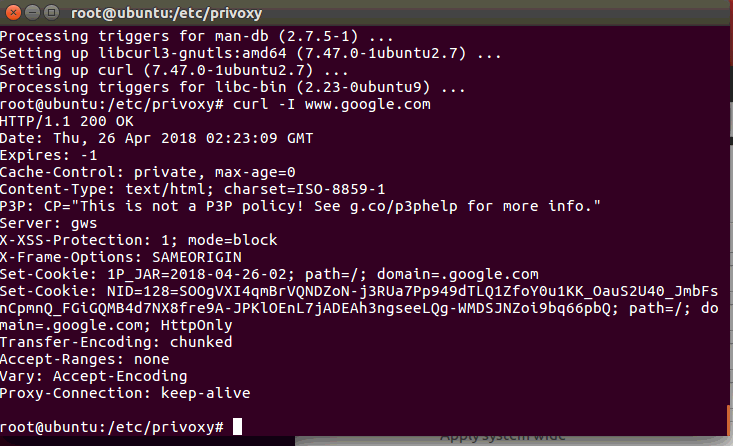
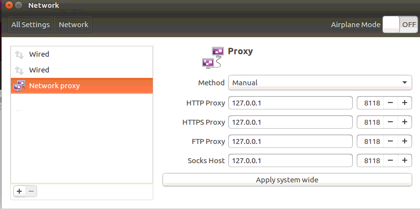
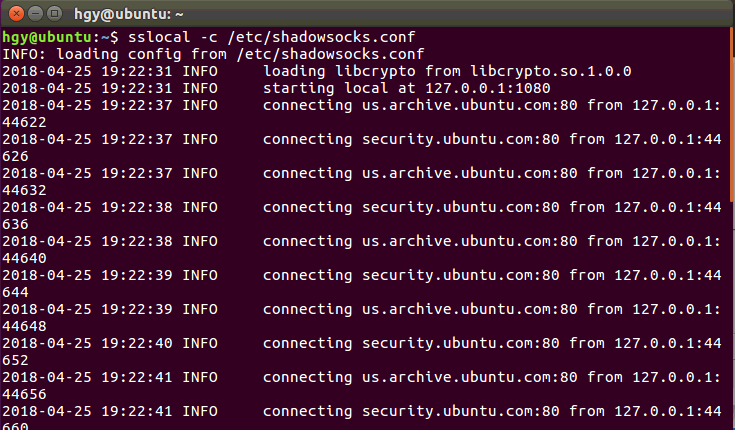

1. 安装shadowsocks
```
pip install shadowsocks
ln -s /usr/local/python/bin/sslocal /usr/bin/sslocal
```
2. 配置ss
```
vi /etc/shadowsocks.conf
{
    "server":"45.76.79.153",
    "server_port":2018,
    "local_address": "127.0.0.1",
    "local_port":1080,
    "password":"admin123",
    "timeout":300,
    "method":"aes-256-cfb",
    "fast_open": false,
    "workers": 1
}
```
3. 启动ss
```
sslocal -c /etc/shadowsocks.conf
```
4. 安装privoxy
```
apt-get install privoxy
```
5. 配置privoxy，编辑`/etc/privoxy/config`
```
listen-address HOSTNAME:8118
forward-socks5t / 127.0.0.1:1080 .
```
6. 让终端走代理，修改`/etc/profile`
```
export https_proxy=http://127.0.0.1:8118
export http_proxy=http://127.0.0.1:8118
export ftp_proxy=http://127.0.0.1:8118
```
7. 重启，验证
```
service privoxy start
curl www.google.com811
```

8. 上述步骤执行完后，终端可以走代理，但是浏览器还不能走代理，需要做如下设置

9. 启动ss， 打开浏览器


