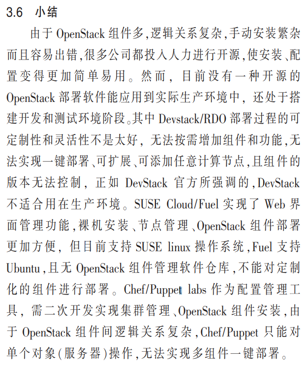

自动化部署平台需求
===========================

目标用户
---------------

有简单系统运维经验的 IT 人员，了解基本的网络、虚拟化、云计算等概念。

通过简单的培训，这些人员即能使用部署平台完成以下的工作

- 独立完成系统部署，并能在出现错误时，通过日志正确地汇报错误
- 监控平台的日常负载、错误事件
- 能进行节点迁移等工作

目标功能
--------------

提供以下目标功能

- 系统部署
- 应用部署
- 监控和运维

自动化部署方案调查
============================

devstack
--------------------
該方式主要是通過配置一個安裝腳本，執行Shell命令來安裝OpenStack的開發環境，支持CentOS、Debian等系列系統。

RDO
--------------
RDO是由Red Hat紅帽開源的一個自動化部署OpenStack的工具，支持單節點（all-in-one）和多節點（multi-node）部署。但RDO只支持CentOS系列操作系統。需要注意的是，該項目並不屬於OpenStack官方社區項目。

Puppet
------------------
Puppet由Ruby語言編寫。Puppet是進入OpenStack自動化部署中早期的一個項目。目前，它的活躍開發群體是Red Hat、Mirantis、UnitedStack等。Mirantis出品的Fuel部署工具，其大量的模塊代碼使用的便是Puppet。

SaltStack
---------------
SaltStack也是一個開源的自動化部署工具，基於Python開發，實現了批量系統配置、批量程序部署、批量運行命令等功能，和Ansible很相似。不同之處是，由於SaltStack的Master和Minion認證機制及工作方式，因此需要在被控端安裝Minion客戶端。

Ansible
----------------
Ansible是一個自動化部署配置管理工具，已被Red Hat收購。它基於Python開發，集合了眾多運維工具（Puppet、Chef、SaltStack等）的優點，實現了批量系統配置、批量程序部署、批量運行命令等功能。Ansible一方面總結了Puppet設計上的得失，另一方面也改進了很多設計。比如基於SSH方式工作，故而不需要在被控端安裝客戶端。

Fuel
--------------------
其功能涵蓋了通過自動化PXE方式安裝操作系統、DHCP服務、Orchestration編排服務和Puppet安裝相關服務等，此外還有OpenStack關鍵業務健康檢查和log實時查看等非常好用的功能。

优点
- 集成度很高的部署方案，https://wiki.openstack.org/wiki/Fuel 目前为 8.0 版本。
- 支持基本 openstack 部署、ceph 部署（openstack 存储后端）等。
- 支持同时管理多个集群，每个集群使用一个“环境”的概念，在每个环境设置不同的参数。
- 图形化，使用简单。

缺点
- 不支持复杂的配置
- 不支持服务器重新配置
- 不支持对单个服务的单独管理，重启、重新配置等

MAAS+Juju
-------------------

ubuntu 上的使用的部署方案，MAAS 安装 ubuntu ，Juju 管理软件包和配置。

优点

- 图形化，使用简单
- 对 ubuntu 支持非常好
- 配置较全面（命令行下）

缺点

- 部署其它类型 OS 时会显得复杂
- Juju 的配置难度大，没有针对 openstack 的优化

TripleO
-------------------

Openstack on Openstack
利用OpenStack來部署OpenStack，即首先基於V2P（和P2V相反，指把虛擬機的鏡像遷移到物理機上）的理念事先準備好一些OpenStack節點（計算、存儲、控制節點）的鏡像，然後利用已有OpenStack環境的Ironic裸機服務和軟件安裝部分的diskimage-builder部署裸機，最後通過Heat項目和鏡像內的自動化部署工具（Puppet或Chef）在裸機上配置運行OpenStack。和其他部署工具不同的是，TripleO是利用OpenStack已有的基礎設施來部署OpenStack的。

优点

- 使用 openstack ironic 管理物理服务器，然后建立起 openstack 环境

缺点

- openstack 服务配置复杂，缺少图形界面

Crowbar
------------------

由 dell 开发的部署工具

使用配置管理工具的自动化部署方式
-------------------------------

这一类工具不包含裸机安装的功能，只把软件包和软件包配置推送到服务器，现有的方案包括： ansible 和 puppet 。

基于容器的部署
-----------------------------
kolla 项目创建了很多容器，为每种服务都构建了容器，然后使用 ansible 推送配置到服务器启动并执行。
kolla：构建所有服务的镜像
kolla-ansible：执行容器的自动部署
kolla-kubernete：容器的管理，通过k8s来管理整个部署的容器集群，热门，對使用/管理人員的要求會比較高。
Kolla-Mesos項目：使用Mesos部署這些容器，搭建OpenStack環境。

优点：

- 使用ansible和docker，让部署变得简单优雅，ansible依赖少、直接在ssh进行下发；能够高度定制
- 将OpenStack升级的粒度细化到了Service级别，升级失败时，可以很容易回滚
-
- Heat Docker Driver。Sahara通过Heat调用Nova Docker Driver来创建Hadoop集群
- Magnum。用户想通过OpenStack集成现有的一些Docker集群管理工具像K8S、Swarm来管理大规模的Docker集群，建议使用Magnum。
Magnum项目通过Openstack API能够在Openstack中创建基于容器的服务，但它本身并不直接对容器进行操作，而是通过Kubernetes, Swarm或者Mesos后端进行管理。Openstack正式项目Zun具有直接管理docker的功能。

- 原子性升級或者回退OpenStack部署。
- 基於組件升級OpenStack
- 基於組件回退OpenStack

缺点：

http://wiki.sangfor.com.cn/index.php/超融合:集群

修改 linux 开机登录 http://www.2cto.com/os/201504/388854.html

