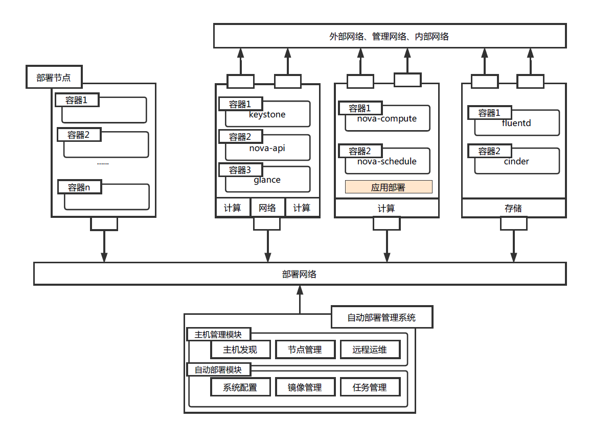
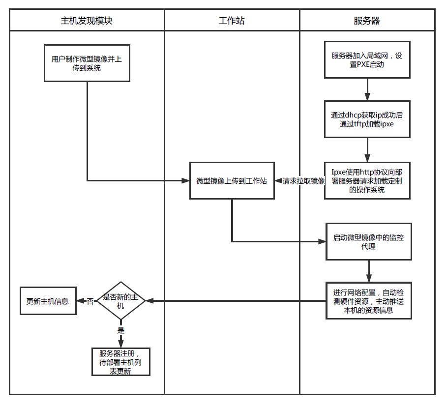
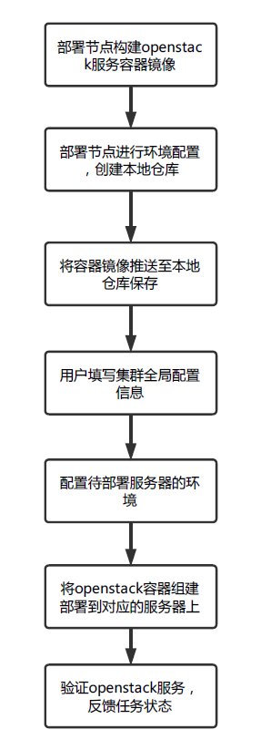
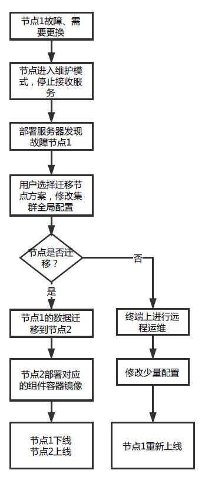
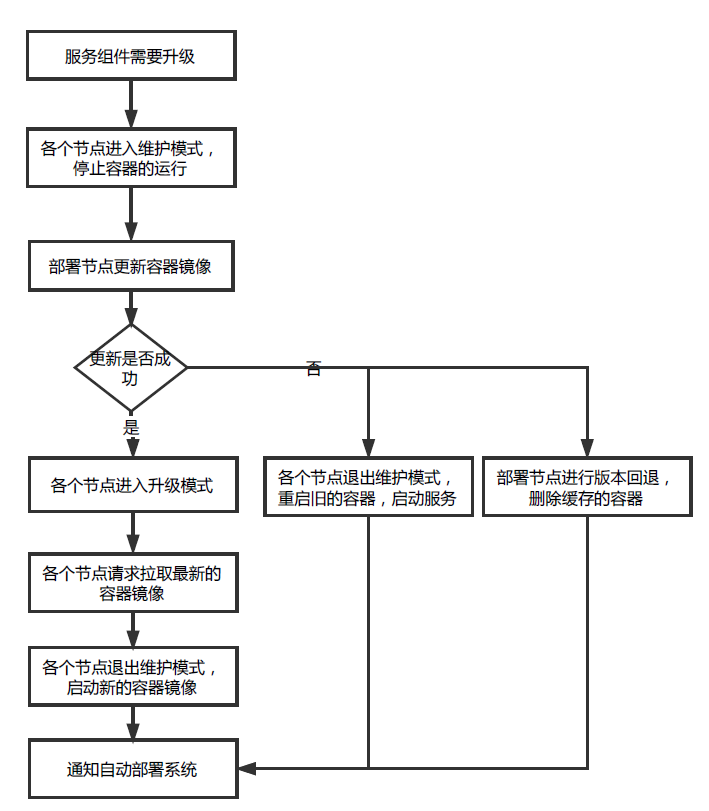

## 项目简述
实现在少人或无人干预下，通过操作系统、openstack环境、云桌面管理终端的自动化部署，实现服务器即插即用，简化云计算基础设施的管理、缩短设备上线的准备时间和减少现场运维人员的工作。

## 功能组成
项目主要由两个模块组成，分别是主机管理模块和自动部署模块。
- 主机管理模块
    - **服务器自动发现**
    终端制作并上传微型镜像，待部署节点通过PXE启动通过部署网络从工作站拉取镜像后，启动并与监控代理进行通信，主动向主机管理系统推送资源信息。收集的主机信息可作为系统自动部署的参考。
    - **集群节点管理**
    负责对集群节点进行管理，用户可以增删节点，监控节点的运行状态以及实时查看节点中openstack服务的运行日志
    - **远程运维**
    提供一个可视化的界面，用户可通过终端直接访问远程主机执行远程运维的操作。
- 自动部署模块
    - **系统配置信息**
    配置信息包括操作系统的信息配置，服务器集群节点角色的全局配置信息，云桌面管理系统的安装配置信息。
    - **镜像管理**
    管理用于主机发现的微型镜像以及用于云操作系统的镜像。提供镜像的上传、查询、删除等操作。
    - **任务管理**
    负责收集部署任务执行的实时输出日志，验证部署任务完成后的环境，部署系统进行下一步任务的调度。自动部署系统提供三种层级的自动部署安装：
    (1)、操作系统自动部署子任务
    (2)、openstack组件自动部署子任务
    (3)、云桌面管理系统自动部署子任务
## 整体框架

## 技术方案
1. **服务器自动发现（微型镜像、硬件信息自动检测）**
自动发现模式(如图1所示)利用DHCP、BOOTP等协议，向节点发送一个定制的微型Linux操作系统镜像。服务器节点通过PXE启动镜像后会自动进行CPU、网络、内存、硬盘等检测，并向系统汇报该节点的硬件配置信息，然后将资源信息主动推送给自动部署系统。

2. **openstack集群部署(容器化openstack组件)**
这里主要是参考了kolla项目的容器化openstack组件的方法，将openstack的各个组件封装为一个个容器，在部署节点构建本地镜像仓库，待部署节点可以直接请求拉取镜像容器，将对应的容器镜像启动即可提供对应的openstack服务。

3. **节点故障**
服务器节点会因硬件损坏或性能问题，而需要定期更换，节点的无缝迁移、升级（纵向扩展）和下线问题直接影响到整个云计算平台的服务稳定性。提供了两种方式来解决这个问题，首先是节点迁移到一个新的节点上，另一种是通过远程运维来排障或者直接更换物理配置，最终保证节点重新上线，不影响原来的服务提供。

4. **openstack版本升级、回退**
openstack版本升级和回退直接影响到云计算服务。我们容器化了openstack服务，升级的时候只需要将最新的容器镜像拉取到本地，然后停止旧的容器镜像，启动新的容器镜像，即可完成升级。如果升级过程受到了中断，无法启动新的容器镜像，那么可以进行版本回退，启动旧的容器镜像，仍然能够提供云计算服务。等待升级镜像完成，再重新执行升级。

## 优点、创新点
- 服务器自动发现：制作微型镜像，镜像分发，服务器硬件信息自动检测
- 节点无缝迁移、升级和下线 - 版本升级回退 通过容器的方式，停止旧的容器，拉取新的容器镜像
- 集群计算能力动态扩容 - 用户配置集群的节点全局配置信息，新的计算节点拉取openstack服务容器镜像，并启动，即可完成动态扩容，不影响原来服务的提供。
